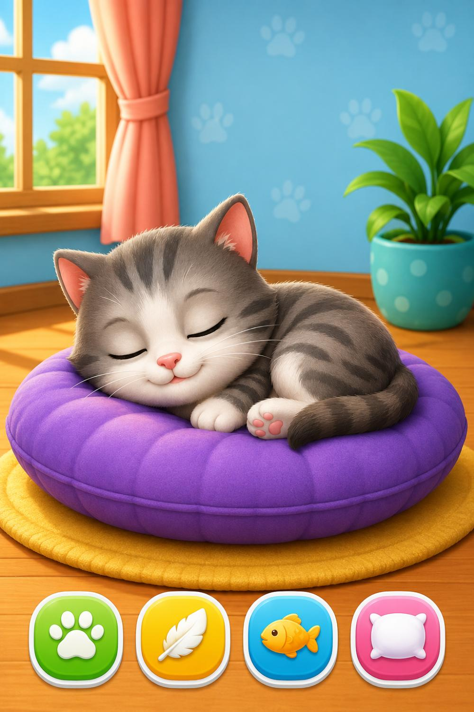

# 🐱 ঘুমকাতুরে বিড়াল (Sleepy Cat)

বাচ্চাদের জন্য তৈরি করা একটি **cute interactive sleeping cat** ওয়েব অ্যাপ।  
কোনো জটিল নিয়ম নেই — শুধু **Tap → Reaction → Sound → Animation → Fun**!



## ✨ Features (V1.0)

- 🐱 সুন্দর ঘুমন্ত বিড়াল + breathing animation
- 🐾 **আদর** — ট্যাপ করলে বিভিন্ন reaction (মিঁয়াও, চোখ খোলা, বিরক্ত মুখ)
- 🪶 **জাগাও** — Feather দিয়ে নাক/কান/পেট/পায় tickle
- 🐟 **খাওয়াও** — মাছ drag করে খাওয়ানো + NOM NOM
- 🛏️ **বালিশ** — বালিশ দিয়ে ঘুম পাড়ানো (অনেকবার disturb করলে ঠেলে দেবে!)
- 😴 Random idle events (হাই, পা নাড়ানো, স্বপ্ন ইত্যাদি)
- 🔊 Web Audio API দিয়ে sound effects (offline কাজ করে)
- 🎵 Soft ambient music ON/OFF
- 🌙 Night mode
- 💾 LocalStorage — taps, fish, reactions, achievements
- 🏆 ছোট ছোট achievement
- 📱 Mobile-first, বড় বাটন, kids-friendly UI

## 📁 Project Structure

```
sleepy-cat-app/
├── index.html
├── manifest.json
├── README.md
├── css/
│   ├── style.css
│   ├── animations.css
│   └── responsive.css
├── js/
│   ├── app.js
│   ├── cat.js
│   ├── interactions.js
│   ├── sounds.js
│   └── storage.js
└── assets/
    └── cat/
        └── sleeping-cat.png
```

## 🚀 কিভাবে চালাবে

### অপশন ১: সরাসরি ব্রাউজারে
1. `index.html` ফাইলটি ডাবল-ক্লিক করো অথবা Live Server দিয়ে খোলো।
2. মোবাইলে টেস্ট করতে চাইলে একই ওয়াইফাই-এ local server চালাও।

### অপশন ২: GitHub Pages
1. এই রিপো GitHub-এ আপলোড করো।
2. Settings → Pages → Deploy from main branch।
3. লিংক পেয়ে যাবে।

### অপশন ৩: Android APK (Capacitor / WebView)
```bash
npm install @capacitor/core @capacitor/cli
npx cap init "Sleepy Cat" "com.yourname.sleepycat"
npx cap add android
npx cap sync
npx cap open android
```

## 🎮 কীভাবে খেলবে

| বাটন | কাজ |
|------|-----|
| 🐾 আদর | বিড়ালকে ট্যাপ করো — reaction দেখো |
| 🪶 জাগাও | Feather টেনে বিড়ালের গায়ে দাও |
| 🐟 খাওয়াও | মাছ টেনে বিড়ালের কাছে নিয়ে যাও |
| 🛏️ বালিশ | বালিশ দিয়ে ঘুম পাড়াও |

## 🛠️ টেকনোলজি

- Pure **HTML + CSS + JavaScript** (কোনো framework নেই)
- **Web Audio API** — সাউন্ড ফাইল ছাড়াই কাজ করে
- **LocalStorage** — ডেটা সেভ
- Progressive Web App ready (`manifest.json`)

## 📌 পরবর্তী ভার্সনে যোগ করা যায়

- Catch the Fish mini-game
- Bubble pop game
- Paw print matching
- Interactive short stories
- আরও expression / sprite animation

## ❤️ License

MIT — স্বাধীনভাবে ব্যবহার করো, মডিফাই করো, শেয়ার করো।

---

Made with 😻 for little kids who love cats.
